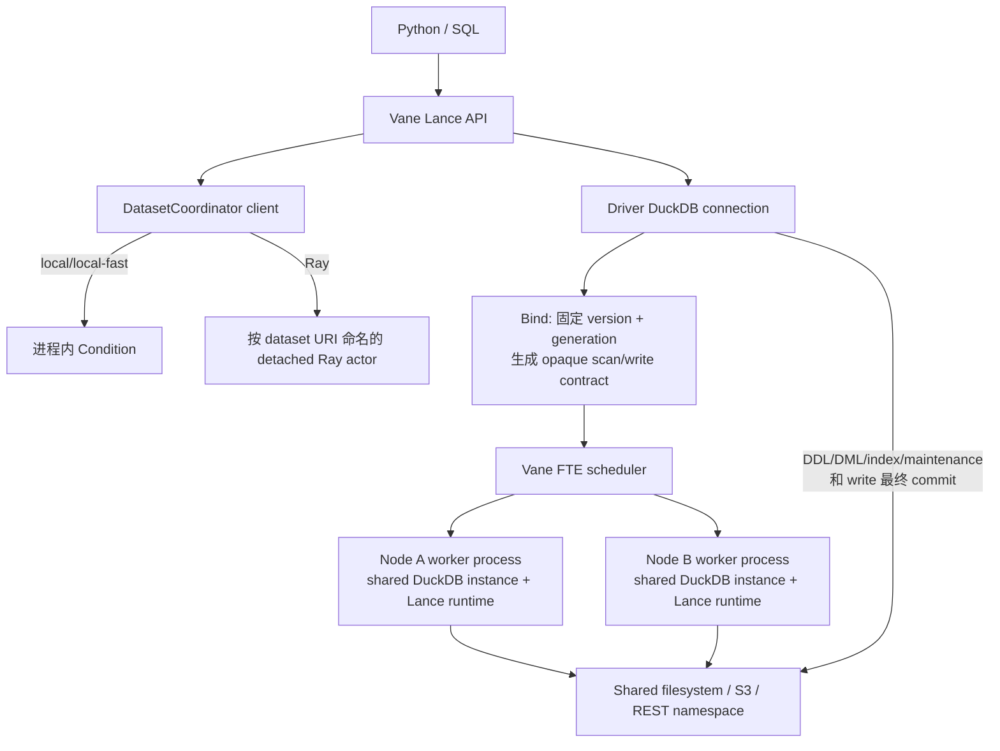
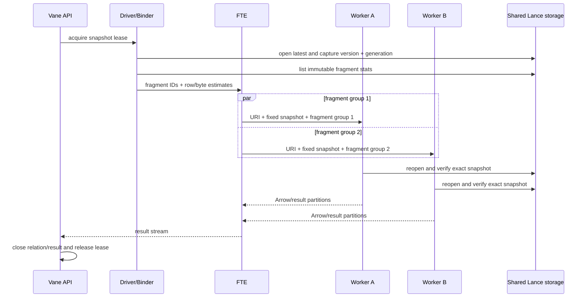
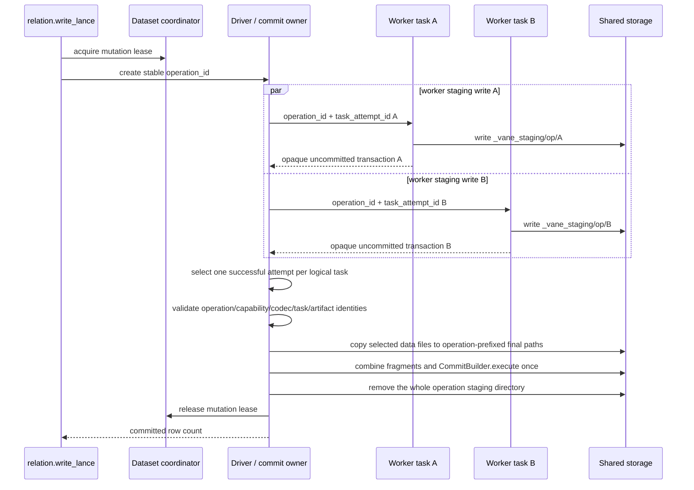

# Vane 集成 lance-duckdb：改动与并发模型

本文说明当前分支如何把面向单机 DuckDB 的 `lance-duckdb` 集成到 Vane，重点回答三件事：

1. 集成实际修改了哪些层；
2. scan、search、write、DDL/DML 和 maintenance 在 Vane 中如何执行；
3. 在多线程、多进程和多节点环境中，哪些部分能够并行，哪些部分仍然串行，以及一致性边界在哪里。

本文描述的是当前代码，而不是目标设计。独立的
[`lance-duckdb`](https://github.com/hubgeter/lance-duckdb) 固定在 revision
`856203ca15bdf21e1f6c2962038ccbd4598573b0`。全部 SQL/Python 用法和实际执行记录见
[`LANCE.md`](LANCE.md)。

## 1. 结论先行

集成后的执行模型不是“在每个节点各运行一个不相关的单机 Lance extension”，而是：

- Vane driver 在 bind 时固定 Lance dataset 的 version 和 generation；
- 普通 scan 按不可变 fragment 拆成 FTE task，可以跨进程、跨节点并行；
- vector、FTS、hybrid search 为保证全局 Top-K 正确性，只生成一个 global source task；
- 分布式 write 让多个 worker 并行写各自的 staging dataset，但最终只由 driver 组合 fragment 并提交一个 Lance transaction；
- 同一 dataset 的公共 Python API 通过普通 snapshot、consistent snapshot、mutation、vacuum 四种 lease
  协调并发；POSIX local 模式还用 advisory file lock 覆盖同机同用户的多个 Vane 进程；
- Lance 仍负责底层格式、MVCC version、optimistic transaction、索引和对象存储 I/O。

因此，“集成后的并发性”需要分四层理解：

| 层 | 控制内容 | 当前并发边界 |
| --- | --- | --- |
| Dataset 协调层 | 同一 dataset 的读、改、VACUUM 次序 | 多读；一写；读写可重叠；VACUUM 独占 |
| Vane Ray/FTE 层 | task 跨 worker/node 调度，CPU/内存准入，attempt 重试 | fragment scan 和 write task 可横向扩展 |
| DuckDB 进程内层 | pipeline、cursor、TaskScheduler | 普通 scan 可多线程；search source 和单个 write sink 串行 |
| Lance Rust 层 | async I/O、编码、对象存储、后台 writer | 每进程一个共享 Tokio runtime；writer 有有界生产者/消费者流水线 |

这些层不是同一把“并发开关”。例如，FTE 可以同时运行多个 search 请求，但每个 search 的
source 本身仍只有一个 task；write 可以有多个并行 worker writer，但 dataset 最终只有一次 commit。

## 2. 为什么不能直接使用上游单机扩展

上游扩展默认运行在一个 DuckDB 进程里，可以直接持有 Rust dataset handle、当前连接的
secret 和 writer state。Vane 的分布式计划会被序列化并在其他进程重建，因此直接搬入会产生四类问题：

- **句柄不能跨进程**：Rust/C++ 指针、Arrow stream 和连接对象不能放进物理计划；
- **快照会分裂**：若每个 worker 独立打开 latest version，同一次查询可能混读多个提交版本；
- **搜索不能随意切片**：各 fragment 的局部 Top-K 直接拼接不能保证全局排名语义；
- **写入不能多点提交**：每个 worker 各自 append/overwrite 会产生多个事务、重复提交和不确定重试；
- **凭证不能进入计划**：S3 key、REST bearer token 和自定义 header 不能跟随 plan bytes 或日志传播；
- **VACUUM 需要读生命周期**：只有记录正在使用旧 snapshot 的查询，才能避免在查询期间回收其文件。

本次集成的核心就是把这些“单进程隐含状态”改造成显式的、可序列化的协议。

## 3. 实际改动清单

### 3.1 源码引入、构建和发布

| 改动 | 实现 |
| --- | --- |
| 外部固定来源 | CMake 从 [`hubgeter/lance-duckdb`](https://github.com/hubgeter/lance-duckdb) 获取精确 commit；Vane 不复制源码，也不使用 submodule |
| 独立维护 | Vane-specific C++/Rust adapter 在 lance-duckdb 的 `lance-impl` 分支维护，Vane 只保存 URL 和 immutable revision |
| 无嵌套 gitlink | `lance-impl` 删除上游 `duckdb` 和 `extension-ci-tools` submodule；编译器、DuckDB 源码和测试入口全部由 Vane 提供 |
| 单一 DuckDB ABI | Lance C++ extension 直接使用 Vane 的 [`external/duckdb`](external/duckdb)，没有第二份 DuckDB |
| 静态链接 | 只构建 `lance_extension` static target，并链接进 `vane._native`；运行时不需要 `INSTALL`/`LOAD` |
| Rust 构建 | 使用外部仓库固定的 `Cargo.lock`，保留原仓库声明的 AWS、Azure、GCP、OSS、HuggingFace 和 REST namespace 特性 |
| 依赖策略 | 跟随 lance-duckdb/Lance 上游依赖，不在 Vane 保存 `vendor-patches`；已知 `quick-xml 0.39.4` 风险见 [`SECURITY.md`](SECURITY.md) |
| 原生链接 | 统一使用仓库 vcpkg 的 OpenSSL，并通过 `--gc-sections` 去除不可达 static-extension code |
| sdist/wheel | sdist 保存固定 URL/revision，构建 wheel 时获取扩展源码；源码本身不进入 Vane sdist |
| 合规 | 增加 provenance、third-party、Cargo license bundle 和 release artifact 检查，并禁止 sdist 重新带入扩展源码 |

主要入口是 [`cmake/lance_extension_config.cmake`](cmake/lance_extension_config.cmake)、
[`cmake/duckdb_loader.cmake`](cmake/duckdb_loader.cmake)、[`pyproject.toml`](pyproject.toml)、
[`SOURCE_PROVENANCE.md`](SOURCE_PROVENANCE.md) 和独立的
[`lance-duckdb`](https://github.com/hubgeter/lance-duckdb/tree/856203ca15bdf21e1f6c2962038ccbd4598573b0)。

### 3.2 复用 Vane 的 distributed extension I/O SPI

这个 feature branch 的 DuckDB fork 已经提供通用 extension scan/write 协议。本次集成没有把 Lance
逻辑硬编码到 Ray scheduler，而是让 Lance 注册自己的 capability、bind codec 和 task codec。

当前连接快照会校验以下 contract：

```text
lance{
  table_function:__lance_exec@1,
  table_function:__lance_namespace_scan@1,
  table_function:__lance_scan@1,
  table_function:__lance_table_scan@1,
  table_function:lance_fts@1,
  table_function:lance_hybrid_search@1,
  table_function:lance_vector_search@1,
  write_operator:lance_write@1
}
```

这带来两个隔离边界：

- planner 只能生成数据库实例已经注册的 capability；
- worker 必须以完全相同的 extension、protocol version 和 codec 解码任务，否则 fail closed。

通用 SPI 位于
[`distributed_table_function.hpp`](external/duckdb/src/include/duckdb/function/distributed_table_function.hpp)
和
[`extension_write_task_provider.hpp`](external/duckdb/src/include/duckdb/execution/distributed/extension_write_task_provider.hpp)，
Lance adapter 分别在
[`lance_scan.cpp`](https://github.com/hubgeter/lance-duckdb/blob/856203ca15bdf21e1f6c2962038ccbd4598573b0/src/lance_scan.cpp)、
[`lance_search.cpp`](https://github.com/hubgeter/lance-duckdb/blob/856203ca15bdf21e1f6c2962038ccbd4598573b0/src/lance_search.cpp) 和
[`lance_write.cpp`](https://github.com/hubgeter/lance-duckdb/blob/856203ca15bdf21e1f6c2962038ccbd4598573b0/src/lance_write.cpp) 中注册。

### 3.3 Python/Relation API

Vane 新增了以下公共入口：

- `vane.read_lance()` 和 `connection.read_lance()`；
- `relation.write_lance()` / `relation.to_lance()`；
- `LanceDataset`、`LanceNamespace`、`LanceTable`、`LanceMergeBuilder`；
- vector、FTS、hybrid search；
- create/show/drop/optimize index；
- optimize、vacuum、automatic cleanup；
- namespace attach/detach、CTAS、INSERT、UPDATE、DELETE、MERGE、TRUNCATE 和 ALTER helpers；
- `LanceCommitOutcomeUnknownError` 和 `LanceCommitCleanupError`。

同时补齐了 `table_function(..., named_parameters=...)`，使 Python API 可以无字符串拼接地调用
Lance search 的命名参数。native relation 还可以持有 Python dependency，使 snapshot lease 跟随派生
relation 和结果流的生命周期，而不是在 `read_lance()` 返回时就提前释放。

这些入口主要位于 [`vane/lance`](vane/lance)、[`vane/__init__.py`](vane/__init__.py)、
[`src/vane_py/pyconnection.cpp`](src/vane_py/pyconnection.cpp) 和
[`src/vane_py/pyrelation.cpp`](src/vane_py/pyrelation.cpp)。原始 lance-duckdb SQL surface 仍然可用；
Python helper 是类型检查、lease 和错误语义更明确的一层封装。

### 3.4 Storage、namespace 和凭证

当前 native 数据面编译并真实验证的是：

- 本地/共享文件系统；
- AWS S3 及 S3-compatible endpoint，包括 `s3a`/`s3n` 到 `s3` 的规范化；
- directory namespace；
- REST namespace。

`TYPE LANCE` secret 支持 config、credential chain 和 environment provider，并以 URI scope 选择。
连接快照在 worker connection 上重建 temporary secret；物理计划只保留 URI、固定版本、投影、过滤、
split 和非敏感 replay-secret name，不保存 access key、bearer token、API key 或 header value。

GCS、Azure、OSS 和 Hugging Face 的 secret option/scope/redaction surface 有覆盖，但当前 Cargo build
只启用了 Lance 的 `aws` storage feature，不能把这类配置覆盖等同于真实云数据面支持。

### 3.5 测试、示例和辅助修复

集成增加了：

- [`tests/fast/test_lance.py`](tests/fast/test_lance.py)：fragment scan、global search、分布式
  create/append/overwrite、空数据集和失败清理；
- [`tests/fast/test_lance_coordinator.py`](tests/fast/test_lance_coordinator.py)：本地线程和真实 Ray actor 的
  lease 顺序；
- 五个带断言的 [`examples/lance_*.py`](examples)，覆盖本地、Ray、secret、MinIO 和 REST；
- package/static-extension/connection-snapshot/release artifact 测试。

另外有两个为集成闭环所需的修复：

- local FTE 把稳定的 task-attempt identity 传入 native runtime，保证本地 callback write 也能生成隔离的
  staging path；
- unversioned dataset cache 在新 query bind 时刷新，保证另一个 connection 的 commit 或 REST CTAS
  能被后续查询看到，已经 bind 的查询仍继续使用旧版本。

## 4. 总体架构



Dataset coordinator 是控制面，只授予 lease，不转发 Arrow batch，也不执行 Lance commit。分布式 write 的
最终 commit owner 是 driver 侧持有物理 root/provider 的 DuckDB connection。

## 5. 读取如何并行

### 5.1 普通 fragment scan



具体语义如下：

- 一个 elementary task 对应一个 Lance fragment，并携带 row/byte estimate；
- Vane 再按目标 worker slot 和估算字节把 elementary task 分组，因此一个 FTE task 可以扫描多个 fragment；
- worker 收到的是 URI、numeric version、generation identity、projection、filter 和 opaque fragment ID；
- worker 重新打开并校验固定版本，不接受“打不开旧版本就退回 latest”；
- 一个 task 内若有多个 fragment，DuckDB scanner thread 通过 atomic index 领取 fragment，最大线程数通常是
  `min(DuckDB threads, selected fragments)`；
- 空 dataset 会生成显式 empty descriptor，表示合法零行，而不是缺失 task metadata；
- filter/projection 和 deferred materialization 仍在 Lance/DuckDB 边界下推。

单次 scan 的横向并发上限首先受 **fragment 数量** 限制。只有一个 fragment 的 dataset 不会仅因集群有
很多节点就自动变成很多 source task；fragment 很多时，FTE 会为了避免过细任务而分组。

### 5.2 不能按 fragment 拆分的 global scan

以下路径生成一个 `lance-global-v1` task：

- REST namespace `query_table`；
- sampling；
- row-id point take；
- 已下推且必须全局处理的 limit/offset；
- global Lance ExecIR；
- 其他明确要求完整 dataset scanner 的路径。

它们仍可使用 Lance 内部 async I/O，但单次 source 不会跨多个 Ray node。

### 5.3 Snapshot、cache 和可见性

新查询 bind 时会刷新 latest cache entry，并记录 version + generation。versioned cache key 包含这两个值，
因此并发 mutation 后：

- 已 bind 的查询继续读旧版本；
- 新 bind 的查询看到成功 commit 后的新版本；
- 同一个查询的不同 worker 不会混读新旧版本；
- index build、append 或 optimize 不需要阻塞正在运行的 reader。

cache 不跨进程共享。Ray worker actor 内的任务共享该 actor 的 DuckDB database/session state；不同 worker
进程各自打开和缓存 dataset。

REST namespace 的 `query_table` bind 会先取得具体 table version，后续分页请求都携带该 version；Arrow IPC
file/stream 响应按字段名校验 schema 和列顺序。因此 REST relation 与普通 mutation 可以按 MVCC 并发，且
不会在一次 scan 内混读多个版本；vacuum/drop 仍需等待其普通 snapshot lease。

## 6. Search 如何并行

vector、FTS 和 hybrid search 都注册一个 `lance-search-global-v1` task。这样 `_distance`、`_score`、
`_hybrid_score` 和最终 Top-K 在同一个固定 snapshot 上计算，不会错误地把 fragment-local Top-K 直接拼接。

当前并发性是：

- 单次 search 的 source task 只放到一个 worker；
- search table function 的 DuckDB `MaxThreads()` 是 1；
- Lance/DataFusion、索引读取和对象存储仍可在该进程的 Tokio runtime 中执行异步工作；
- 多个独立 search 查询可以由 FTE 同时放入同一 worker 或不同 worker，受 task/memory admission 限制；
- search 后的 projection、join、aggregate 和 exchange 仍可进入普通分布式 pipeline；
- hybrid 的 vector/FTS candidate 和融合发生在同一个 Rust call/global task 中，不是两个 Ray 子查询；
- REST namespace 当前没有 hybrid query contract，会明确返回 unsupported error。

因此，多节点主要提高 **多查询吞吐量**，当前不会直接缩短一个超大 search 的 source 延迟。

## 7. 分布式写入如何并行且只提交一次

这是相对于单机扩展最重要的改造。当前实现不是“所有上游数据汇聚到一个 worker 再写”，而是 worker
并行产生 fragment，driver 只拥有最终 publish 权限。



### 7.1 Worker 阶段

每个被选择的 FTE task/attempt 写独立路径：

```text
<dataset>/_vane_staging/<hex(operation_id)>/<hex(task_attempt_id)>
```

worker 使用 `execute_uncommitted_stream` 创建 staging dataset，只 finalize 成一个未提交 transaction。返回给
driver 的是序列化 transaction 和受校验的 artifact metadata，不是 dataset handle，也不是全部 Arrow 数据。

同一个 task 内：

- `PhysicalDistributedExtensionWrite::ParallelSink()` 为 `false`；
- `SinkOrderDependent()` 为 `true`；
- C++ callback 用 mutex 保护 writer 和 row count；
- C++ producer 与 Rust writer 之间是容量为 2 的同步 channel；
- Rust writer 使用一个专用 OS thread，并借助进程共享 Tokio runtime 做编码/对象存储工作。

所以单个 task 的 DuckDB sink 调用是串行的，但 producer、writer 和 async I/O 之间存在有界流水线；真正的
横向 write 并发来自多个 task/process/node 同时写不同 staging dataset。

### 7.2 Driver 最终提交

driver/provider 会：

1. 验证 operation ID、attempt ID、codec、fragment 数量和 staging URI；
2. 只使用 FTE 为每个 logical task 选中的成功 attempt；
3. 校验各 task schema/config 完全兼容；append 还要求与已有 dataset 的 field ID、metadata 等精确兼容；
4. 把 staging data file 复制到带 operation/task 前缀的最终 `data/` key，并重写 fragment path；
5. 把所有 worker fragment 组合成一次 Append 或 Overwrite operation；
6. 使用一次 `CommitBuilder` 发布一个新 Lance version；
7. 清理整个 operation staging 目录，其中也包括未被选择的 speculative attempt。

driver 不接收每个 batch，因此网络数据面不会被强制汇聚到 driver；但 finalization 仍需要在 driver 进程发起
对象枚举、复制和一次 commit，其延迟会随 task/file 数及存储 copy 实现增长。

`create`、`append`、`overwrite` 和零行输入都走同一协议。零行输入仍提交带输入 schema 的空 dataset。

### 7.3 幂等和 attempt 隔离

- 同一次执行的 `operation_id` 稳定；每次 FTE retry/speculation 有不同 `task_attempt_id`；
- operation ID 和 row count 被写入 Lance transaction properties，并在 `_vane_operations/` 写入独立于
  Lance version history 的 durable marker；
- finalization 重入优先读取 durable marker；只有发现该 operation 的 destination file 已被某个 version
  引用但 marker 缺失时，才扫描 transaction history 做兼容性 reconciliation/backfill；
- 相同 operation ID、mode 和 row count 会返回已提交成功；
- 若 operation ID 相同但 row count 不同，会 fail closed；
- abort 会先确认该 operation 是否已经 commit，再决定能否删除 operation-prefixed destination file；
- 用户重新调用一次 `write_lance()` 会得到新的 operation ID，不能用它盲目重试 outcome-unknown 的写入。

## 8. DDL、DML、索引和维护在哪里执行

下列操作当前不是跨节点 FTE data-plane task，而是在调用方/driver connection 中执行一次 Lance transaction
或 namespace request：

- directory/REST namespace attach、detach、list、create/drop table；
- INSERT、UPDATE、DELETE、TRUNCATE、ALTER 和 MERGE；
- create/drop/optimize index；
- OPTIMIZE、VACUUM 和 automatic cleanup 命令。

Python helper 会为 mutation 或 vacuum 获取对应 lease。读取仍可与普通 mutation 重叠，因为 Lance commit
只发布新 version；VACUUM、drop table 和 namespace detach 使用独占语义，等待已登记 snapshot 结束。
`LanceTable` 的 INSERT/CTAS/UPDATE/DELETE/MERGE 在调用方 connection 中执行，不进入分布式 write data
plane；只有 `relation.write_lance()` 走 worker staging + driver final commit。

直接原始 SQL 仍可调用全部 lance-duckdb 功能，但 SQL 不一定经过 `vane.lance` helper，因此可能绕过
DatasetCoordinator，尤其裸 SQL `VACUUM LANCE` 无法等待 Python 持有的 relation lease。Python mutation
helper 要求 autocommit；不要把多个会立即外部提交的 Lance 操作包在 DuckDB 显式事务里并期待整体
rollback。扩展对已知不可回滚的 write/index DDL 路径会提前拒绝不支持的显式事务。

## 9. DatasetCoordinator 的并发规则

### 9.1 同一 dataset 的兼容矩阵

| 已运行/申请 | 新普通 snapshot | 新 consistent snapshot | 新 mutation | 新 vacuum |
| --- | --- | --- | --- | --- |
| 普通 snapshot | 可以 | 可以 | 可以 | 等待全部 snapshot 释放 |
| consistent snapshot | 可以 | 可以 | 等待 | 等待 |
| mutation | 可以 | 等待 | FIFO 等待 | 等待 mutation 释放 |
| active vacuum | 等待 | 等待 | 等待 | 等待 |
| waiting vacuum | 等待 | 等待 | 等待 | vacuum 之间不承诺 FIFO |

额外规则：

- mutation 队列在一个 coordinator 内是 FIFO，一次只有一个 active owner；
- 不同 dataset 使用不同 coordinator，不互相阻塞；
- snapshot lease 跟随 relation/result stream，plan pickle 只产生不拥有 lease 的 placeholder，driver 始终是
  唯一 release owner；
- mutation 和 snapshot 可以重叠，符合 Lance MVCC；
- waiting vacuum 会阻止新的 snapshot、consistent snapshot 和 mutation，避免持续流量饿死 vacuum；
- consistent-snapshot waiter 会优先于后续 mutation，避免控制面 reader 被连续写入饿死；
- 多个 vacuum waiter 之间没有显式队列，不能把它当作严格公平锁。

### 9.2 Coordinator 身份和作用域

Dataset identity 会移除 URI userinfo、query 和 fragment，lowercase scheme/host，把本地路径转为绝对路径，
并把 `s3a`/`s3n` 规范化为 `s3`。这样凭证不会进入 actor name，相同存储 identity 也更容易汇合。

| 运行环境 | Coordinator 实现 | 能协调的参与者 |
| --- | --- | --- |
| local/local-fast（POSIX） | 进程内 `Condition` + identity-scoped advisory file lock | 同机、同用户、同 coordinator 目录的 Vane connection/process |
| local/local-fast（Windows） | Python 进程内全局 map + `threading.Condition` | 同一个 Python 进程中的 connection/thread |
| Ray | `vane-lance-<sha256(uri)>` detached async actor，namespace `vane-lance` | 同一个 Ray control plane 中使用相同 identity 的 driver/process |
| 两台机器上的 local 进程 | 两套 coordinator/file-lock 域 | 不能互相看见 |
| 两个 Ray cluster | 两个 named actor namespace | 不能互相看见 |
| 外部 Lance writer | 不使用 Vane coordinator | 不能参与 Vane lease |

backend 在第一次 lease acquisition 时固定。如果 DatasetCoordinator 已选择 local，随后把 runner 改成 Ray
会 fail closed，避免同一对象在两套锁之间漂移。

所有 acquire 支持有限 timeout；状态包含 token，Ray 还记录 job/actor/node/pid/thread owner。POSIX local
进程退出后内核会释放 file lock，诊断记录按 pid 清理。Ray 不使用 TTL 自动回收 active mutation，因为
driver 消失后远端 commit 仍可能执行；detached actor 可保留孤儿 token。actor 重建或 incarnation 丢失时会
fail closed，必须由 operator 在证明实际 reader/writer 已停止后，用 `lease_status()`、精确 token 的
`force_release()` 或 `recover_ray_dataset_coordinator(..., expected_identity=...)` 显式恢复。

## 10. 多线程、多进程和多节点分析

### 10.1 执行拓扑

| 场景 | 进程/线程布局 | scan | search | write | 协调范围 |
| --- | --- | --- | --- | --- | --- |
| `local-fast` | 一个 Python/DuckDB 进程 | DuckDB/Lance 进程内并行 | 单 global source | 单进程 writer/commit | 本进程 |
| local FTE | 一个 Python 进程；可配置多个 logical worker/background loop；executor thread 使用 thread-local connection/cursor | fragment task 可在线程间并行 | 每查询一个 global task；多查询可并发 | 多 task staging 可并行，最终一次 commit | 本进程 |
| 单节点 Ray | 每个 Vane worker manager 在该节点启动一个常驻 `RayWorkerActor` 进程 | 多 task 在 actor 的独立 cursor 上并发 | 多查询共享 actor runtime | 多 task staging；一次 driver commit | 同 Ray control plane |
| 多节点 Ray | 每个 worker manager 在每个有 CPU/memory 的节点启动一个 actor 进程 | fragment group 可跨节点 | 单次 source 仍只落一个节点 | staging task 可跨节点，commit 在 driver | 同 Ray control plane |
| 多个同机 POSIX local 进程 | 每个进程有独立 DuckDB/runtime/cache；共享 identity file lock | 可同时读共享存储 | 可同时搜索 | writer/vacuum 受 advisory lock 排除 | 同用户、同 coordinator 目录 |
| 多个 Ray cluster/外部 writer | 每套 control plane 独立 | 可同时读 | 可同时搜索 | 依赖 Lance optimistic conflict | 无跨集群 Vane 协调 |

“每节点一个 actor”是 **每个 Vane worker manager** 的布局。多个独立 driver/manager 可以在同一节点各有一个
worker actor；它们会共享 dataset coordinator actor，但不会共享 DuckDB instance 或 Tokio runtime。

### 10.2 Ray worker 进程内并发

一个 `RayWorkerActor`：

- 共享一个 DuckDB connection/DatabaseInstance 和 TaskScheduler；
- 为每个 native task 建立独立 cursor/ClientContext；
- actor RPC concurrency 很高，但 FTE task manager 默认最多同时 admission `num_cpus` 个 native task，并受
  task heap memory budget 限制；
- persistent actor 本身不独占整台节点的 Ray CPU resource，FTE 在更高层记录和调度 task resource；
- 并发 task 共享进程级 Lance Tokio runtime、网络连接池和底层存储带宽。

因此 actor 的 `max_concurrency` 不是可以同时满速运行的查询数，也不是 CPU quota。多个 driver/manager、
DuckDB pipeline thread 和 Tokio thread 仍可能在 OS 层竞争同一组 CPU。

### 10.3 Lance Tokio runtime

每个进程通过 Rust `OnceLock` 只初始化一个 Tokio multi-thread runtime。线程数优先级是：

1. `VANE_LANCE_WORKER_CPUS`；
2. `OMP_NUM_THREADS`；
3. `std::thread::available_parallelism()`；
4. 获取失败时为 1。

它在第一次 Lance 调用时固定，之后修改环境变量不会改变现有 runtime。当前 worker 启动代码会传播用户已
设置的 `VANE_*` 非敏感环境变量，但不会根据 Ray node CPU 自动写入 `VANE_LANCE_WORKER_CPUS`。如果需要严格
限制 Rust runtime，应该在 worker 第一次使用 Lance 前显式设置。

Lance bind data 中目前存在 `task_cpu_slots` 字段，但当前代码没有把它连接到 FTE weighted permit/admission。
它不能视为“一个 global search 已保留 N 个 CPU”。真正生效的边界仍是 FTE task 数/内存、DuckDB
`threads` 和 Tokio runtime thread 数。

### 10.4 用户线程

同一 Python 进程内，DatasetCoordinator 的 Condition 和 lease close 都是线程安全的。若应用要并发发起
查询，应给各线程使用独立 connection/cursor；不要把同一个 DuckDB connection 当作任意线程并发 API。

多个线程对同一 dataset 使用公共 API 时：

- 多个 read/search 可以重叠；
- mutation 按 coordinator 到达顺序串行；
- read 可以与 mutation 重叠，并保持 bind 时 snapshot；
- vacuum 等待读和写，然后独占；
- 对不同 dataset 的操作没有 dataset-level 互斥。

## 11. 各功能的最终并发性

| 功能 | 单次操作内部并发 | 同 dataset 多请求 | 多节点收益 | 主要串行点 |
| --- | --- | --- | --- | --- |
| 普通 scan | fragment FTE task 跨节点；task 内可按 fragment 多 DuckDB thread | 多读并发，可与 mutation 重叠 | 高，前提是 fragment 足够且 storage 共享 | bind、结果汇总；fragment 太少时 |
| Global scan / REST query | 一个 source task，Lance 内部 async I/O | 多查询可并发 | 主要提高吞吐，不缩短单 source | 单 global task |
| Vector/FTS/hybrid | 一个 global source，DuckDB MaxThreads=1 | 多查询可并发，可与 mutation 重叠 | 主要提高吞吐 | 单次 search/ranking source |
| Relation create/append/overwrite | 多 worker staging task 并行；每 task 有 writer pipeline | 公共 API 同 dataset 一次一个 mutation；reader 可并发 | 高，写数据阶段可扩展 | 每 task sink；driver file-copy/final commit |
| DML/DDL/MERGE | driver connection 内执行 | 公共 helper 同 dataset 串行 | 当前没有单操作跨节点收益 | driver-side transaction |
| Index build/drop/optimize | driver connection/Lance 内部并发 | 与同 dataset mutation 串行；reader 可继续旧 version | 当前没有 FTE 横向扩展 | driver-side mutation |
| VACUUM/drop table | driver connection 执行 | 等待已登记 read 和 mutation 后独占 | 无 | exclusive lease 和 storage deletion |
| 不同 dataset | 各自独立 | 可以并发 | 可以分散到不同 worker/node | 共享 CPU、内存、网络、store 限额 |

## 12. 一致性、故障和重试

| 阶段/结果 | Dataset 可见性 | 清理 | 能否重新发起新 write |
| --- | --- | --- | --- |
| worker 或上游在 final commit 前明确失败 | 没有新 version | abort 清理 operation staging 和未提交 destination file | 可以按业务策略重试 |
| speculative/retried attempt 未被选择 | 不可见 | 成功或 abort 时按整个 operation 清理 | 不需要用户处理 |
| final commit 明确成功 | 原子出现一个新 version | staging best-effort 清理，随后 release lease | 不应重复 |
| 同 operation finalization 重放 | 查询 transaction properties 并返回相同行数 | 再次尝试清 staging | 幂等，不产生第二个 version |
| commit outcome unknown | 可能已经出现新 version | 不删除可能已发布的 artifact | **不能用新 operation ID 盲目重试** |
| commit 成功但 mutation lease release 失败 | 已经出现新 version | 抛出 cleanup error | **不能重试写入** |
| 外部 writer/另一 cluster 冲突 | 由 Lance optimistic transaction 判定 | 只清当前 operation 自有 artifact | 只在确认未提交后决定 |

Vane 用 `LanceCommitOutcomeUnknownError` 表示 commit ACK/外层 transaction 结果不确定；runner 的有限恢复
可以使用同一个 operation ID 做 reconciliation，但用户层的新函数调用会生成新 ID。用
`LanceCommitCleanupError(committed=True, safe_to_retry=False)` 表示数据已经提交、只是在释放 mutation lease
时失败。这两个错误都不是普通 transient retry signal。

进程在 cleanup 前硬崩溃仍可能留下 `_vane_staging/<operation>`。新 operation 使用不同前缀，不会擅自删除
一个结果未知的旧 operation；当前也没有跨 operation 的自动 orphan-staging GC。durable operation marker
使同一 operation 的 reconciliation 不依赖可能已被 vacuum 的 transaction history。Ray driver 硬崩溃还
可能留下前述 detached coordinator lease，恢复前必须核对 marker/version 和 owner 状态。

## 13. 多节点部署的前提和限制

### 13.1 存储必须被所有执行节点一致访问

- 普通本地路径在 driver bind 时规范化为绝对路径；
- 多节点只有在每台机器把这个路径映射到同一个共享文件系统、且语义一致时才安全；
- 节点各自的 `/tmp/items.lance` 即使字符串相同，也不是同一个 dataset；
- 生产多节点优先使用 S3/S3-compatible store，并用 scoped `TYPE LANCE` secret；
- write worker、driver finalizer 和后续 reader 都必须有相同的存储可达性和权限。

### 13.2 当前没有覆盖的“全局锁”

Vane coordinator 不是外部一致性服务。以下情况只依靠 Lance transaction/version 机制：

- 两台机器、不同 OS 用户或不同 coordinator 目录下的 local Python 进程；
- 两个 Ray control plane；
- Vane 与 PyLance、LanceDB 或其他 writer 并发；
- 绕过 Python helper 的原始 SQL。

尤其是 VACUUM：Lance optimistic commit 可以检测 writer 冲突，但 Vane 无法知道另一 control plane 仍在使用
哪个旧 snapshot。跨 cluster VACUUM 需要更高层的运维协调，不能仅依赖当前 DatasetCoordinator。

### 13.3 性能上的现实瓶颈

- scan 并行度由 fragment 数和分组策略决定，不等于 cluster CPU 总数；
- global search 是单 source task；
- distributed write 的 data encode/I/O 可横向扩展，但最终 object copy、fragment 组合和 commit 是单 owner；
- 同 dataset mutation 的公共 API 吞吐受单 mutation lease 限制，这是为了可预测语义；
- 每进程共享 Tokio runtime，多个 query 会竞争其线程、连接池和对象存储限额；
- FTE admission 是调度限制，不是 cgroup；多个 driver/manager 仍可能造成主机级 oversubscription；
- fragment 太少限制并行度，fragment/小文件太多又会放大调度和最终 commit 成本，需要通过 write sizing 和
  compaction 找平衡。

## 14. 验证证据与边界

本集成已有的实际执行证据记录在 [`LANCE.md`](LANCE.md#12-本文的实际验证记录)：

| 项目 | 已验证 |
| --- | --- |
| 本地完整 SQL/Python 功能 | `examples/lance_complete.py`，通过 |
| 单机 Ray fragment scan/global search/distributed write | `examples/lance_distributed.py`，通过 |
| secret provider/scope/redaction | `examples/lance_secrets.py`，通过 |
| S3-compatible 数据面 | 本地 MinIO 上的分布式读写、搜索和 namespace，通过 |
| REST namespace | 本地真实 HTTP/Arrow IPC RestAdapter，通过 |
| focused tests | non-Ray 93 passed；shared-Ray 7 passed |
| release shards | non-Ray 564 passed；Ray 17 passed |
| complete fast shards | non-Ray 6283 passed；shared-Ray 110 passed、2 skipped；7 个 cluster-owner case 分进程通过 |
| coordinator 并发 | 本地线程顺序和真实 Ray named actor 顺序测试，通过 |
| 分布式 write | 多 task file prefix、每次操作一个 transaction、失败清理，通过 |

必须区分“执行验证”和“代码路径分析”：

- Ray 实际执行是一台物理机器上的多 worker/task，不是真实多机网络压测；
- MinIO 验证了真实 S3 protocol，但不是 AWS 账号；
- REST 使用真实本地 adapter，不是外部托管服务；
- GCS/Azure/OSS/HF 只有配置 surface 验证，且当前 build 未启用其数据面；
- 独立 local 进程、两个 Ray cluster、外部 writer race 和 driver hard-crash recovery 没有端到端并发测试；
- 本文对真实多节点拓扑的结论来自 worker-per-node、plan serialization、shared-storage 和 coordinator 代码
  路径审计，不应当当作已经完成的吞吐、故障注入或网络分区验证。

## 15. 关键代码索引

| 主题 | 代码 |
| --- | --- |
| Python Dataset/Namespace/Table API | [`vane/lance/__init__.py`](vane/lance/__init__.py) |
| Snapshot/mutation/vacuum coordinator | [`vane/lance/_coordinator.py`](vane/lance/_coordinator.py) |
| Relation read/write 和 lease dependency | [`src/vane_py/pyrelation.cpp`](src/vane_py/pyrelation.cpp)、[`src/vane_py/pyrelation/initialize.cpp`](src/vane_py/pyrelation/initialize.cpp) |
| Ray 每节点 worker 创建 | [`vane/runners/ray/worker_pool.py`](vane/runners/ray/worker_pool.py) |
| Ray worker 共享 DuckDB 和 task admission | [`vane/runners/ray/worker.py`](vane/runners/ray/worker.py) |
| Local FTE thread-local execution | [`vane/runners/local/runner.py`](vane/runners/local/runner.py) |
| Generic extension scan contract | [`external/duckdb/src/include/duckdb/function/distributed_table_function.hpp`](external/duckdb/src/include/duckdb/function/distributed_table_function.hpp) |
| Fragment task grouping | [`external/duckdb/src/execution/distributed/pipeline_node/translator_scan.cpp`](external/duckdb/src/execution/distributed/pipeline_node/translator_scan.cpp) |
| Generic extension write contract | [`external/duckdb/src/include/duckdb/execution/distributed/extension_write_task_provider.hpp`](external/duckdb/src/include/duckdb/execution/distributed/extension_write_task_provider.hpp) |
| Worker callback sink | [`external/duckdb/src/execution/operator/persistent/physical_distributed_extension_write.cpp`](external/duckdb/src/execution/operator/persistent/physical_distributed_extension_write.cpp) |
| Driver transaction/outcome handling | [`src/vane_py/ray/distributed_plan_bindings.cpp`](src/vane_py/ray/distributed_plan_bindings.cpp) |
| Lance snapshot/fragment scan | [`src/lance_scan.cpp`](https://github.com/hubgeter/lance-duckdb/blob/856203ca15bdf21e1f6c2962038ccbd4598573b0/src/lance_scan.cpp) |
| Lance global search | [`src/lance_search.cpp`](https://github.com/hubgeter/lance-duckdb/blob/856203ca15bdf21e1f6c2962038ccbd4598573b0/src/lance_search.cpp) |
| Lance distributed writer adapter | [`src/lance_write.cpp`](https://github.com/hubgeter/lance-duckdb/blob/856203ca15bdf21e1f6c2962038ccbd4598573b0/src/lance_write.cpp) |
| Rust writer/final commit/idempotency | [`rust/ffi/write.rs`](https://github.com/hubgeter/lance-duckdb/blob/856203ca15bdf21e1f6c2962038ccbd4598573b0/rust/ffi/write.rs) |
| Per-process Tokio runtime | [`rust/runtime.rs`](https://github.com/hubgeter/lance-duckdb/blob/856203ca15bdf21e1f6c2962038ccbd4598573b0/rust/runtime.rs) |
| Dataset cache/version reopen | [`src/lance_dataset_cache.cpp`](https://github.com/hubgeter/lance-duckdb/blob/856203ca15bdf21e1f6c2962038ccbd4598573b0/src/lance_dataset_cache.cpp) |
| 完整能力与执行记录 | [`LANCE.md`](LANCE.md)、[`examples`](examples) |

## 16. 最终评价

当前集成已经把 Lance 的普通读取和写数据阶段接入 Vane 的分布式数据面，同时保留 Lance 单版本读取和
单事务发布语义。它最适合的工作负载是：共享对象存储上的多 fragment scan、分布式上游计算以及能够拆成
多个 writer task 的批量 create/append/overwrite。

当前最主要的并发上限是：单次 search/global scan 不跨节点、DDL/DML/index/maintenance 在 driver 执行、
同 dataset mutation 由公共 API 串行、write final commit 单 owner，以及 coordinator 不跨 Ray cluster。
如果后续要继续提升并发，优先方向应是全局 search 的可合并分布式 Top-K、driver finalization 的对象复制
成本、真实多节点故障测试、orphan lease/staging 回收，以及把 Lance 的 CPU 权重真正接入 FTE admission。
