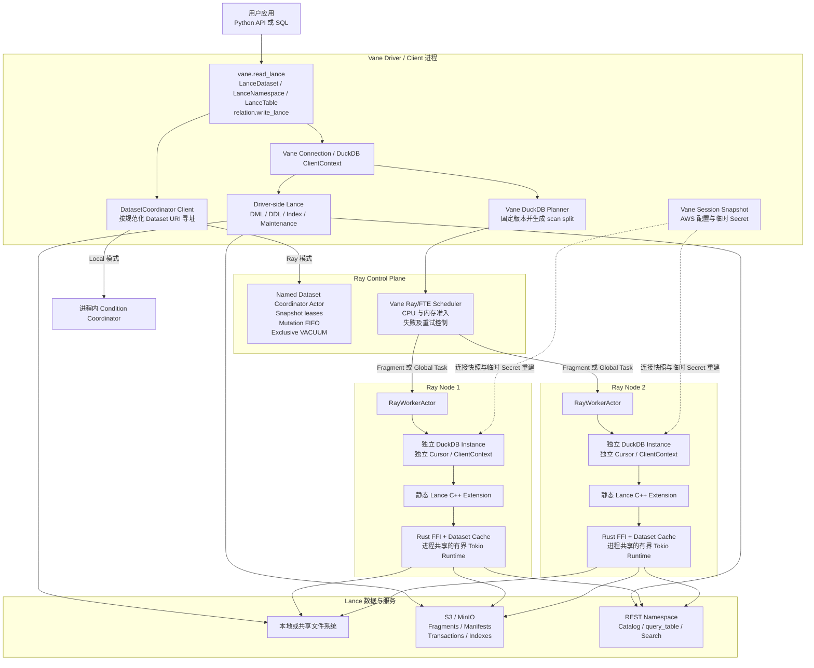
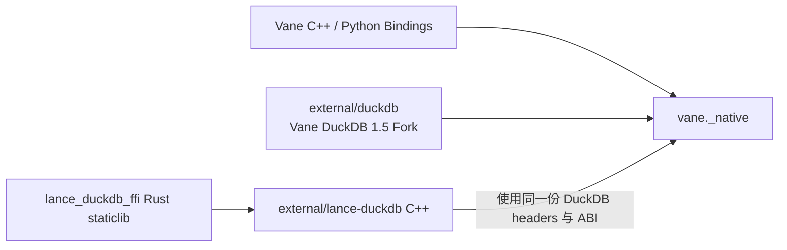
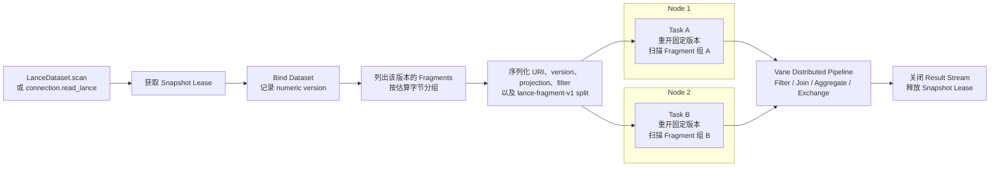
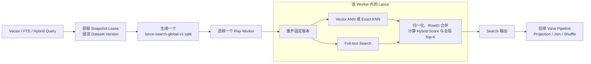
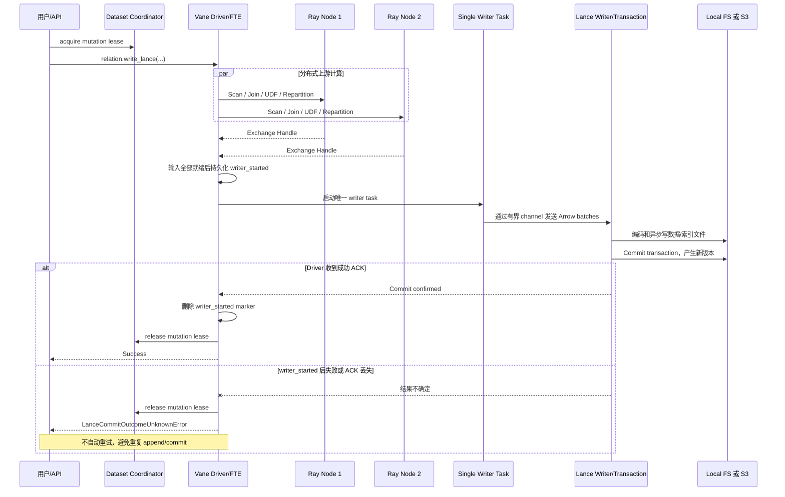
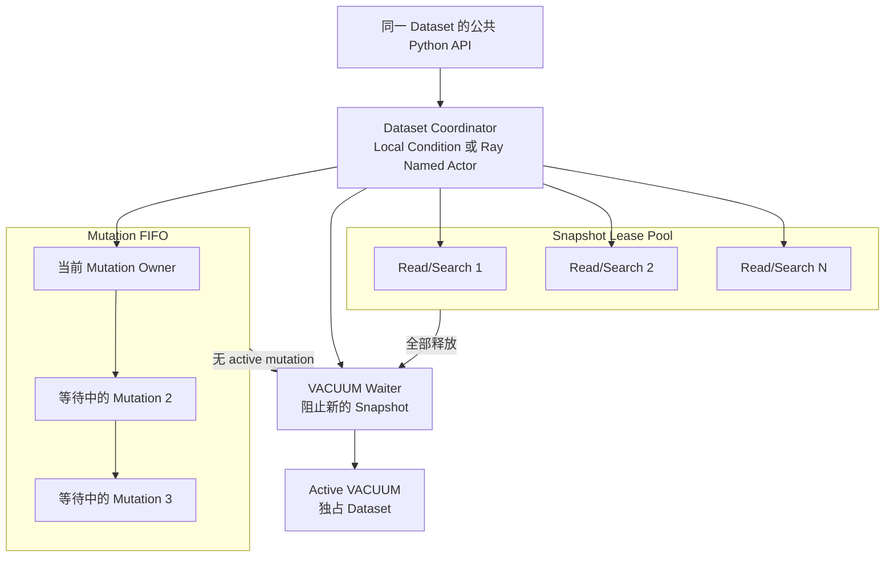
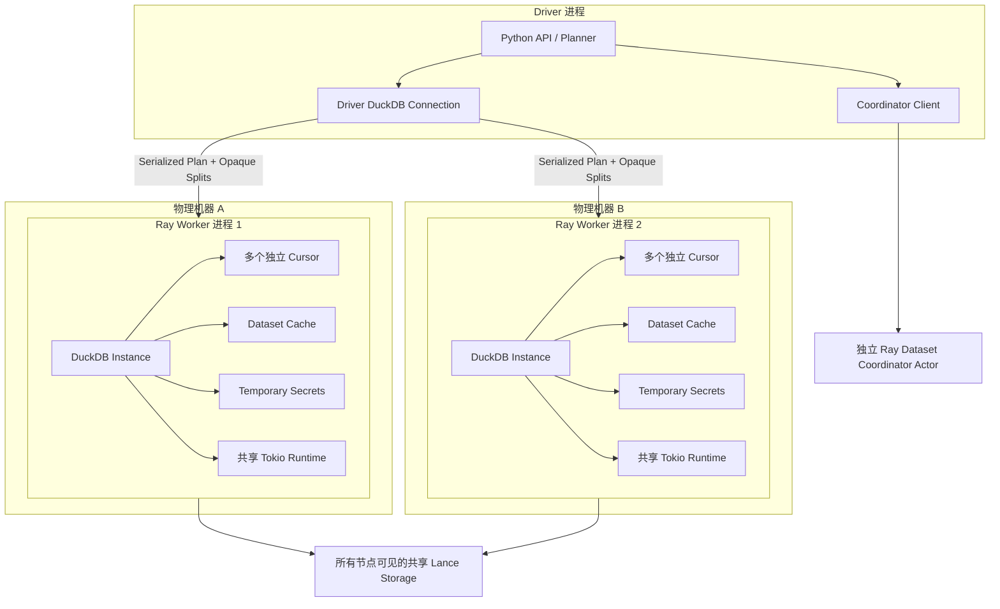
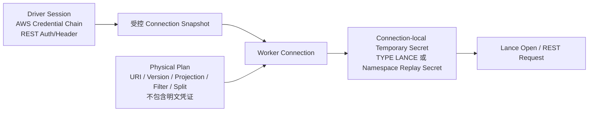

# Vane 与 Lance 集成架构图

本文用架构图说明 Vane 集成 Lance 后的组件边界、读取、搜索、写入、并发协调，
以及多线程、多进程和多节点执行方式。

本文描述当前工作区实现。更完整的接口和并发语义见
[`LANCE_INTEGRATION.md`](LANCE_INTEGRATION.md)，可执行示例见
[`LANCE_COMPLETE_EXAMPLES.md`](LANCE_COMPLETE_EXAMPLES.md)。

## 1. 一句话概括

Vane 负责 Python API、DuckDB SQL、分布式计划、Ray/FTE 调度、资源准入和 dataset
级并发协调；Lance 负责数据格式、版本、事务、索引、搜索和底层存储 I/O。

Vane 只保留一套 DuckDB：Lance C++ extension 和 Rust static library 都静态链接到
`vane._native`，不在运行时执行 `INSTALL lance` 或 `LOAD lance`。

## 2. 总体组件架构

图中的实线是主要调用或数据路径，虚线是 worker connection 配置重建路径。
Dataset coordinator 属于控制路径，不转发 Arrow 数据。

### 2.1 组件职责

| 组件 | 主要职责 |
| --- | --- |
| `vane.lance` | Dataset、Namespace、Table、MergeBuilder 等公共 Python API |
| Dataset coordinator | 同一 dataset 的 snapshot、mutation 和 vacuum lease 协调 |
| Vane DuckDB fork | SQL bind、固定版本、物理计划、opaque split 和 single-writer sink |
| Ray/FTE | 跨节点任务调度、exchange、CPU/内存准入和失败边界 |
| Lance C++ extension | DuckDB table function、COPY、DML/DDL、索引和 maintenance 集成 |
| Lance Rust FFI | Dataset、scanner、writer、search、index、transaction 和 namespace 操作 |
| Tokio runtime | 每个进程共享的 Lance 异步执行和对象存储 I/O 线程池 |
| Local/S3/REST | Lance 数据文件、事务、索引以及 namespace 服务 |

## 3. 构建与 ABI 边界

`lance-duckdb` 上游仓库中的 DuckDB gitlink没有参与构建。Vane 使用自己的 DuckDB
fork，并把 Lance 自有 C++/Rust 源码作为 in-tree static extension 编译进去。

## 4. 普通读取：按 Fragment 跨节点扫描

普通扫描的关键点：

- bind 时记录 dataset version，查询中的所有 task 都重开同一版本；
- split 只携带可序列化数据，不传递 Rust/C++ dataset handle、裸指针或 Arrow stream；
- 一个 task 可以持有一个或多个 fragment；
- 计划任务数受 fragment 数、目标 partition 数和可用 worker slot 共同影响；
- 查询进行期间发生 append、建索引或 optimize，不会让同一查询混读两个版本；
- 多个 snapshot 可以并发，也可以和 mutation 同时运行。

以下扫描不会按 fragment 分布，而是使用一个 `lance-global-v1` source task：

- REST namespace `query_table`；
- sampling；
- row-id point lookup；
- 需要全局处理的 limit/offset；
- optimizer 生成的全局 Lance ExecIR；
- 其他必须使用全局 dataset scanner 的路径。

## 5. Vector、FTS 与 Hybrid Search

三类搜索使用单个全局 source，原因是 `_distance`、`_score`、`_hybrid_score` 和
最终 Top-K 必须在完整数据集范围内计算。Vane 不会让多个 fragment 各算一次局部
Top-K 后再自行拼接。

这不等于搜索完全串行：

- Lance/DataFusion 可以在该 worker 进程内使用多线程和异步 I/O；
- 不同搜索请求可以被调度到不同 worker 并发执行；
- search 后面的普通关系算子仍可进入分布式 pipeline；
- 单次 search 的 source 阶段不会横跨多个 Ray node；
- hybrid 的 vector 与 FTS candidate scan 当前在同一个 global task 中顺序执行，
  随后在 Rust 中融合，而不是两个并行 Ray 查询。

## 6. 分布式写入：多节点计算、单事务提交

这里的“single writer”只表示一个 Lance transaction owner 和一个 commit 权限：

- writer 上游的 scan、join、UDF 和 repartition 可以跨节点并行；
- 所有上游 exchange 最终由一个 writer task 消费；
- DuckDB COPY sink 按 batch 调用同一个 writer；
- C++ 与 Rust writer 之间使用容量有限的同步 channel 形成背压；
- Rust writer 有专用后台线程；
- 文件编码和对象存储 I/O 可以使用进程内共享 Tokio runtime 并发执行。

`writer_started` 是重试边界：屏障前失败可以按普通 FTE 策略处理；屏障后失败不能
自动再次提交。成功 finalization 被 driver 确认后，marker 会被清理。

## 7. Dataset Coordinator 并发模型

同一 dataset 的协调规则：

- 多个 snapshot 可以同时持有；
- snapshot 与 mutation 可以重叠；
- mutation 按进入顺序 FIFO，一次只有一个 owner；
- index create/drop/optimize、DML、DDL、MERGE 和普通写入都属于 mutation；
- VACUUM 等待 active mutation 和所有已登记 snapshot；
- 有 VACUUM waiter 时暂停接纳新 snapshot，避免长时间读流量饿死 VACUUM；
- active VACUUM 期间不允许 snapshot 或 mutation 进入；
- 不同 dataset 使用不同 coordinator，因此可以并发操作。

Coordinator 使用去除 userinfo、query 和 fragment 后的规范化 URI 作为身份；`s3a://`
和 `s3n://` 会规范化为 `s3://`。Ray 模式使用
`vane-lance-<sha256(normalized-uri)>` named actor，同一 Ray control plane 中连接同一
dataset 的多个 driver 会找到同一个 actor。

## 8. 多线程、多进程和多节点

### 8.1 多线程

每个进程只有一个由 `OnceLock` 初始化的 Tokio multi-thread runtime。线程数依次取：

1. `VANE_LANCE_WORKER_CPUS`；
2. `OMP_NUM_THREADS`；
3. 当前进程可见的 host parallelism。

Ray worker 在首次 Lance 调用前设置 `VANE_LANCE_WORKER_CPUS`。同一 worker 上的任务
共享 DuckDB `TaskScheduler` 和 Tokio runtime，但使用独立 cursor/ClientContext。
FTE 再使用 CPU slot 和内存预算限制同时进入 native 执行的任务。

CPU slot 是调度权重，不是 cgroup 或硬件级 CPU 隔离。

### 8.2 多进程

- Local FTE 的多个 worker 当前仍在同一个 Python 进程内；
- Ray 模式下，每个有 CPU 的 node 拥有持久 `RayWorkerActor` 进程；
- 每个 worker 进程有独立 DuckDB instance、dataset cache、temporary secret 和 Tokio
  runtime；
- worker 之间传输计划、split、Arrow/exchange 数据和状态，不传 Lance handle；
- 不连接同一个 Ray control plane 的普通 Python 进程不会共享 coordinator。

### 8.3 多节点

- 普通 fragment scan 可以分布到多个物理节点；
- 单次 search、REST `query_table`、global ExecIR 和最终 writer 只在一个节点运行；
- writer 的上游计算仍可以横跨多个节点；
- 不同 search 查询、不同 dataset mutation 和普通 scan 可以调度到不同节点并发；
- 多机器部署推荐 S3/MinIO；本地路径只有在各节点挂载语义一致的共享文件系统时才安全。

## 9. 各类操作的并发与一致性

| 操作 | 单次操作内部并发 | 同一 Dataset 上的并发 | 可见性与一致性 |
| --- | --- | --- | --- |
| 普通 fragment scan | 多个 FTE task 可跨进程、跨节点 | 多读并发，可与 mutation/index build 重叠 | bind 时固定版本，不会混读新旧版本 |
| Global scan / REST query_table | 一个 global source，Lance 内部可并发 | 多查询受 worker admission 限制 | 本地/S3 固定版本；REST 取决于远端服务 |
| Vector search | 一个 global source，在单 worker 内 ANN 或 exact KNN | 多个查询可跨 worker 并发，可与 mutation 重叠 | 只使用固定版本可见的索引 |
| FTS | 一个 global source | 与 vector search 相同 | `_score` 在完整查询范围计算 |
| Hybrid search | 一个 global source，worker 内完成 vector、FTS 和融合 | 多查询可跨 worker 并发 | 三种分数来自同一 dataset handle/version |
| `relation.write_lance` | 多节点上游加一个 writer task | 公共 API 对同 dataset FIFO | commit 前不可见；屏障后失败不自动重试 |
| DML / DDL / MERGE | 当前在调用方 connection 进程执行 | 公共 API 对同 dataset FIFO | 每次成功 commit 产生一个新版本 |
| Index create/drop/optimize | 一个 mutation owner | 与同 dataset mutation 串行；读不被阻塞 | 旧查询继续用旧版本，新 bind 才看到新索引 |
| Index read | 属于 scan/search | 多查询可同时使用 | 不会看到未 commit 的半成品索引 |
| VACUUM | 调用方进程执行 | 等待 snapshot 和 mutation 后独占 | 不删除仍被登记 snapshot 引用的旧版本 |

不同 dataset 虽然有独立 coordinator，但不要在多个线程中同时使用同一个 DuckDB
connection。需要真实并行时，应使用独立 connection 或交给 Ray/FTE 调度。

## 10. 凭证与物理计划边界

S3/MinIO worker connection 会重建 temporary `TYPE LANCE` secret。REST namespace 的
认证值和 headers 通过 connection snapshot 中的临时 replay secret 重建；物理计划
只携带非敏感的 replay secret 名称，不携带 bearer token、API key 或 header value。

这些 secret 是 connection-local 的，一个 connection 不会自动看到另一个 connection
创建的临时 secret。敏感 key 在 secret 展示中被标记为需要脱敏。

## 11. 当前保证的作用域与限制

1. Dataset coordinator 只覆盖 Vane 公共 Python API。直接执行原始 `COPY ... FORMAT
   LANCE`、`INSERT`、`CREATE INDEX` 或 attached-table SQL 可能绕过 coordinator。
2. Coordinator 的共享范围是一个 Ray control plane，不是跨 Ray cluster 的全局锁。
   外部 writer 和其他集群依靠 Lance optimistic transaction conflict detection。
3. Vane 不对 mutation 冲突或 commit outcome unknown 做隐式重试。
4. REST namespace 的跨请求 snapshot 语义由远端 namespace 服务负责。
5. 单次 search 不跨多个节点；这是保证全局 Top-K 正确性的设计选择。
6. DML、DDL、索引和 maintenance 当前主要在调用方进程执行，不进入 Ray FTE task
   admission；需要严格限制 driver-side CPU 时，应在首次使用 Lance 前配置线程数。
7. mutation 与等待中的 VACUUM 当前不承诺严格公平；持续 mutation 可能继续延迟
   VACUUM。
8. 计划中不携带明文凭证不等于凭证不需要分发；凭证仍必须通过受控 session 路径安全
   到达相应 worker connection。

## 12. 关键代码入口

| 主题 | 文件 |
| --- | --- |
| Python Dataset/Namespace/Table API | [`vane/lance/__init__.py`](vane/lance/__init__.py) |
| Dataset coordinator | [`vane/lance/_coordinator.py`](vane/lance/_coordinator.py) |
| Ray worker connection 与 CPU 配置 | [`vane/runners/ray/worker.py`](vane/runners/ray/worker.py) |
| DuckDB opaque scan split 接口 | [`external/duckdb/src/include/duckdb/function/extension_scan_split_provider.hpp`](external/duckdb/src/include/duckdb/function/extension_scan_split_provider.hpp) |
| Scan task 生成 | [`external/duckdb/src/execution/distributed/pipeline_node/translator_scan.cpp`](external/duckdb/src/execution/distributed/pipeline_node/translator_scan.cpp) |
| Single-commit writer 调度 | [`external/duckdb/src/include/duckdb/execution/distributed/plan/runner.hpp`](external/duckdb/src/include/duckdb/execution/distributed/plan/runner.hpp) |
| Lance 普通 scan | [`external/lance-duckdb/src/lance_scan.cpp`](external/lance-duckdb/src/lance_scan.cpp) |
| Vector/FTS/Hybrid search | [`external/lance-duckdb/src/lance_search.cpp`](external/lance-duckdb/src/lance_search.cpp) |
| Dataset cache 与固定版本重开 | [`external/lance-duckdb/src/lance_dataset_cache.cpp`](external/lance-duckdb/src/lance_dataset_cache.cpp) |
| Rust 有界 Tokio runtime | [`external/lance-duckdb/rust/runtime.rs`](external/lance-duckdb/rust/runtime.rs) |
| 完整真实执行示例 | [`examples/lance_complete.py`](examples/lance_complete.py) |
| Ray 与外部服务测试 | [`tests/fast/test_lance.py`](tests/fast/test_lance.py) |
